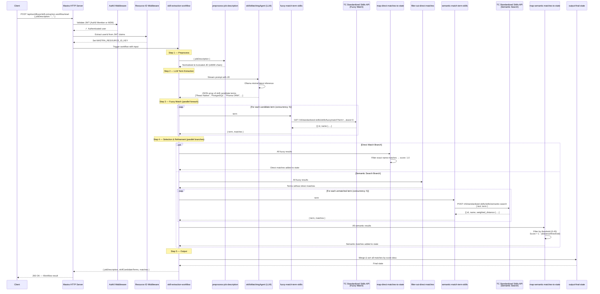
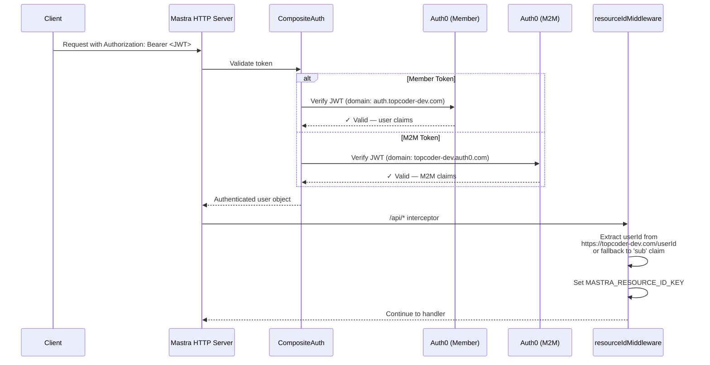
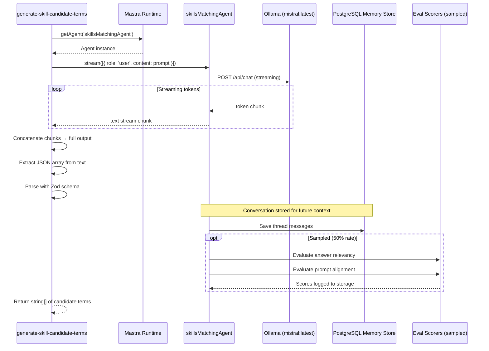

# tc-ai-api — Comprehensive Technical Documentation

## Table of Contents

1. [Overview](#overview)
2. [Technology Stack](#technology-stack)
3. [Project Structure](#project-structure)
4. [Environment Variables](#environment-variables)
5. [Framework Setup — Mastra](#framework-setup--mastra)
6. [Database Layer](#database-layer)
7. [Authentication & Middleware](#authentication--middleware)
8. [Observability & Logging](#observability--logging)
9. [AI Model Provider — Ollama](#ai-model-provider--ollama)
10. [Agents](#agents)
11. [Tools](#tools)
12. [Scorers (Evaluation)](#scorers-evaluation)
13. [Workflows — Skill Extraction](#workflows--skill-extraction)
14. [Sequence Diagrams](#sequence-diagrams)
15. [External API Interactions](#external-api-interactions)
16. [CI/CD Pipeline](#cicd-pipeline)
17. [Deployment](#deployment)

---

## Overview

**tc-ai-api** is a Topcoder AI microservice built on the [Mastra](https://mastra.ai) AI orchestration framework. Its primary capability today is **Skill Extraction** — given a free-text job description, it identifies and matches relevant skills against Topcoder's Standardized Skills taxonomy using a multi-stage pipeline that combines LLM-based term extraction, fuzzy matching, and semantic search.

The service exposes a Hono-based HTTP API (managed by Mastra's built-in server), is authenticated via Auth0 JWTs, uses PostgreSQL for storage and agent memory, runs local LLM inference through Ollama, and ships with built-in observability and evaluation scorers.

---

## Technology Stack

| Layer               | Technology                                                  |
| ------------------- | ----------------------------------------------------------- |
| **Runtime**         | Node.js ≥ 22.13.0 (`.nvmrc`: v24.13.0)                      |
| **Language**        | TypeScript 5.9+ (ES2022, ESM)                               |
| **Package Manager** | pnpm 10.28.0                                                |
| **AI Framework**    | Mastra (`@mastra/core` ^1.2.0)                              |
| **AI SDK**          | Vercel AI SDK (`ai` ^6.0.71)                                |
| **LLM Provider**    | Ollama via `ai-sdk-ollama` ^3.4.0                           |
| **HTTP Server**     | Hono (embedded in Mastra)                                   |
| **Database**        | PostgreSQL via `@mastra/pg` ^1.2.0                          |
| **Auth**            | Auth0 via `@mastra/auth-auth0` ^1.0.0                       |
| **Observability**   | OpenTelemetry via `@mastra/observability` ^1.2.0            |
| **Logging**         | Pino via `@mastra/loggers` ^1.0.1                           |
| **Evals**           | `@mastra/evals` ^1.1.0 (Answer Relevancy, Prompt Alignment) |
| **Schema**          | Zod 4.3+                                                    |
| **Linting**         | ESLint 9 + typescript-eslint                                |
| **Formatting**      | Prettier 3.8+                                               |
| **CI/CD**           | CircleCI → AWS ECS (Fargate)                                |
| **Container**       | Docker (node:24.13.0-alpine)                                |

---

## Project Structure

```
tc-ai-api/
├── .circleci/config.yml          # CircleCI build/deploy pipeline
├── .github/workflows/            # GitHub Actions (code reviewer)
├── .mastra/                      # Mastra build artifacts (git-ignored)
├── src/
│   ├── mastra/
│   │   ├── index.ts              # ★ Mastra instance — wires everything together
│   │   ├── agents/
│   │   │   └── skills/
│   │   │       └── skills-matching-agent.ts   # LLM agent for term extraction
│   │   ├── tools/
│   │   │   └── skills/
│   │   │       ├── standardized-skills-fuzzy-tool.ts    # Fuzzy-match API tool
│   │   │       └── standardized-skills-semantic-tool.ts # Semantic-search API tool
│   │   ├── workflows/
│   │   │   └── skills/
│   │   │       └── skill-extraction-workflow.ts  # ★ Main orchestration workflow
│   │   ├── scorers/
│   │   │   └── skills-matching-scorers.ts        # Evaluation scorers
│   │   └── public/                               # Static assets (empty)
│   └── utils/
│       ├── index.ts              # Barrel re-exports
│       ├── logger.ts             # Pino logger configuration
│       ├── auth/
│       │   └── index.ts          # Auth0 composite auth setup
│       ├── middleware/
│       │   ├── index.ts          # Middleware registration
│       │   └── resourceIdMiddleware.ts  # Resource isolation middleware
│       └── providers/
│           └── ollama.ts         # Ollama AI provider config
├── Dockerfile                    # Production container image
├── appStartUp.sh                 # Container entrypoint
├── package.json
├── tsconfig.json
├── eslint.config.mjs
├── .prettierrc / .prettierignore
└── .env                          # Local environment variables
```

---

## Environment Variables

| Variable                            | Required | Default                                | Description                                                      |
| ----------------------------------- | -------- | -------------------------------------- | ---------------------------------------------------------------- |
| `PORT`                              | No       | `3000`                                 | HTTP server port                                                 |
| `MASTRA_DB_CONNECTION`              | **Yes**  | —                                      | PostgreSQL connection string for Mastra storage and agent memory |
| `MASTRA_DB_SCHEMA`                  | No       | `ai`                                   | PostgreSQL schema name for Mastra tables                         |
| `TC_API_BASE`                       | **Yes**  | —                                      | Topcoder API base URL (e.g. `https://api.topcoder-dev.com`)      |
| `OLLAMA_API_URL`                    | No       | `http://ollama.topcoder-dev.com:11434` | Ollama API endpoint for LLM inference                            |
| `MASTRA_EVAL_MODEL`                 | No       | `mistral:latest`                       | Ollama model used for evaluation scorers                         |
| `AUTH0_DOMAIN`                      | Yes\*    | —                                      | Auth0 domain for member JWT validation                           |
| `AUTH0_AUDIENCE`                    | Yes\*    | —                                      | Auth0 audience (client ID) for member tokens                     |
| `AUTH0_M2M_DOMAIN`                  | Yes\*    | —                                      | Auth0 domain for M2M JWT validation                              |
| `AUTH0_M2M_AUDIENCE`                | Yes\*    | —                                      | Auth0 audience for M2M tokens                                    |
| `DISABLE_AUTH`                      | No       | `false`                                | Set to `"true"` to disable all authentication (dev mode)         |
| `JD_MAX_CHARS`                      | No       | `6000`                                 | Max character length for job description preprocessing           |
| `SKILL_MATCHING_FUZZY_MATCH_SIZE`   | No       | `3`                                    | Number of candidates returned per fuzzy-match query              |
| `SKILL_MATCHING_CONCURRENCY`        | No       | `5`                                    | Concurrency limit for parallel skill-matching requests           |
| `SKILL_MATCHING_SEMANTIC_THRESHOLD` | No       | `0.45`                                 | Max cosine distance for semantic matches (lower = stricter)      |
| `SKILL_DISCOVERY_EVAL_SAMPLE_RATE`  | No       | -                                      | Fraction of agent interactions sampled for evaluation scoring    |

> \* Auth0 variables are required unless `DISABLE_AUTH=true`.

---

## Framework Setup — Mastra

The application is bootstrapped in `src/mastra/index.ts` by instantiating a single `Mastra` object that wires together every subsystem:

```typescript
export const mastra = new Mastra({
  workflows:    { skillExtractionWorkflow },
  agents:       { skillsMatchingAgent },
  scorers:      { ...evalScorers },
  storage:      new PostgresStore({ connectionString, schemaName }),
  logger:       tcAILogger,          // Pino
  observability: new Observability({...}),  // OpenTelemetry
  server: {
    port: 3000,
    auth: apiAuthLayer,              // CompositeAuth (Auth0)
    middleware: middlewareConfig,     // resourceIdMiddleware
  },
});
```

### NPM Scripts

| Script         | Command              | Description                                                     |
| -------------- | -------------------- | --------------------------------------------------------------- |
| `dev`          | `mastra dev`         | Start dev server with hot-reload and Mastra Studio at `/studio` |
| `build`        | `mastra build`       | Production build (bundles into `.mastra/output/`)               |
| `start`        | `mastra start`       | Start production server from build output                       |
| `studio`       | `mastra studio`      | Launch Mastra Studio UI standalone                              |
| `lint`         | `eslint .`           | Run ESLint across the project                                   |
| `lint:fix`     | `eslint . --fix`     | Auto-fix lint issues                                            |
| `format`       | `prettier . --write` | Format all files                                                |
| `format:check` | `prettier . --check` | Check formatting without writing                                |

---

## Database Layer

### Storage Backend: PostgreSQL (`@mastra/pg`)

The application uses a **single PostgreSQL database** with a configurable schema (default: `ai`). Two `PostgresStore` instances are created:

1. **Global Mastra Storage** (`src/mastra/index.ts`)
   - ID: `tc-ai-api-store`
   - Stores: workflow run state, step execution logs, evaluation results, and general Mastra metadata.

2. **Agent Memory Storage** (`src/mastra/agents/skills/skills-matching-agent.ts`)
   - ID: `skills-matching-agent-memory`
   - Stores: conversation threads and message history for the `skillsMatchingAgent`, enabling multi-turn memory when interacting with the agent directly.

Both point to the same connection string (`MASTRA_DB_CONNECTION`) and schema (`MASTRA_DB_SCHEMA`), but are logically separate stores within Mastra's storage abstraction.

### Schema Management

Mastra automatically manages table creation and migrations within the configured PostgreSQL schema. No manual migration steps are required.

### Connection String Format

```
postgresql://<user>:<password>@<host>:<port>/<database>?schema=<schema>
```

---

## Authentication & Middleware

### Auth0 Composite Authentication

Authentication is handled by `CompositeAuth` from `@mastra/core/server`, which evaluates incoming JWTs against **two** Auth0 tenants:

1. **Member tokens** — issued by `AUTH0_DOMAIN` with audience `AUTH0_AUDIENCE`
2. **M2M (machine-to-machine) tokens** — issued by `AUTH0_M2M_DOMAIN` with audience `AUTH0_M2M_AUDIENCE`

A request is authorized if it passes validation against **either** tenant.

Authentication can be fully disabled by setting `DISABLE_AUTH=true` (useful for local development).

### Resource ID Middleware

When auth is enabled, the `resourceIdMiddleware` intercepts all `/api/*` requests and:

1. Extracts the authenticated `user` object from the request context.
2. Derives the Topcoder domain from `TC_API_BASE` (e.g., `topcoder-dev.com`).
3. Reads the user ID from the JWT claim `https://<domain>/userId`, falling back to `sub` for M2M tokens.
4. Sets `MASTRA_RESOURCE_ID_KEY` in the request context, scoping all subsequent Mastra operations (memory, threads, state) to that user.

This ensures **resource isolation** — each user's agent memory and workflow state are segregated.

---

## Observability & Logging

### Logging

A Pino logger (`@mastra/loggers`) is configured at `info` level with the service name `TC AI API`. It is injected into the Mastra instance and made available to all agents, tools, and workflow steps via context.

### Observability (OpenTelemetry)

The `@mastra/observability` package provides:

- **DefaultExporter** — exports spans to the configured OTLP endpoint.
- **SensitiveDataFilter** — a span output processor that redacts sensitive data from telemetry.
- Service name: `tc-ai-api`

All agent interactions, tool executions, and workflow step runs are automatically instrumented.

---

## AI Model Provider — Ollama

LLM inference runs through a self-hosted [Ollama](https://ollama.com) instance. The provider is configured in `src/utils/providers/ollama.ts`:

```typescript
export const ollama = createOllama({
  baseURL: process.env.OLLAMA_API_URL || 'http://ollama.topcoder-dev.com:11434',
});
```

The default model is `mistral:latest` with conservative generation parameters:

| Parameter        | Value | Purpose                                                   |
| ---------------- | ----- | --------------------------------------------------------- |
| `temperature`    | 0.1   | Near-deterministic output for consistent skill extraction |
| `top_p`          | 0.5   | Nucleus sampling cutoff                                   |
| `repeat_penalty` | 1.1   | Reduces repetitive outputs                                |
| `num_predict`    | 2048  | Maximum tokens to generate                                |

---

## Agents

### `skillsMatchingAgent`

| Property    | Value                                        |
| ----------- | -------------------------------------------- |
| **ID**      | `skillsMatchingAgent`                        |
| **Model**   | `ollama('mistral:latest')`                   |
| **Memory**  | PostgreSQL-backed conversation memory        |
| **Scorers** | Answer Relevancy, Prompt Alignment (sampled) |

**System Prompt Behavior:**

The agent is instructed to:

- Parse free text (job descriptions, resumes, etc.) to identify skill candidates.
- Prioritize specific multi-word terms (e.g., "React Native" over "React").
- Aggressively split combined technologies (e.g., "PostgreSQL with Prisma ORM" → two separate terms).
- Output strict JSON arrays of strings — no prose, no markdown.

The agent is used within the workflow's `generateSkillCandidateTerms` step via its `.stream()` method, producing incremental text output that is then parsed into a JSON array.

---

## Tools

### `standardized-skills-fuzzy-match`

| Property   | Value                                                        |
| ---------- | ------------------------------------------------------------ |
| **ID**     | `standardized-skills-fuzzy-match`                            |
| **API**    | `GET {TC_API_BASE}/v5/standardized-skills/skills/fuzzymatch` |
| **Input**  | `{ term: string, size?: number }`                            |
| **Output** | `{ matches: [{ id: string, name: string }] }`                |

Performs fuzzy string matching against Topcoder's standardized skills taxonomy. Returns up to `size` matches for the given term.

### `standardized-skills-semantic-search`

| Property   | Value                                                                    |
| ---------- | ------------------------------------------------------------------------ |
| **ID**     | `standardized-skills-semantic-search`                                    |
| **API**    | `POST {TC_API_BASE}/v5/standardized-skills/skills/semantic-search`       |
| **Input**  | `{ text: string }`                                                       |
| **Output** | `{ matches: [{ id: string, name: string, weighted_distance: number }] }` |

Performs vector-based semantic search against the skills taxonomy. Returns matches ranked by cosine distance.

---

## Scorers (Evaluation)

Two LLM-based scorers evaluate agent output quality at runtime (sampled):

### `skillDiscoveryAnswerRelevancyScorer`

Uses `createAnswerRelevancyScorer` from `@mastra/evals`. Measures whether the agent's response is relevant to the user's input query.

### `skillDiscoveryPromptAlignmentScorer`

Uses `createPromptAlignmentScorerLLM` from `@mastra/evals`. Measures whether the agent's response adheres to the system prompt instructions (evaluation mode: `user`).

Both scorers run on the same Ollama model (`MASTRA_EVAL_MODEL`, default `mistral:latest`) and are sampled at a configurable rate (`SKILL_DISCOVERY_EVAL_SAMPLE_RATE`, default 50%).

---

## Workflows — Skill Extraction

The core business logic lives in `skill-extraction-workflow.ts`, organized as a **main workflow** with **nested sub-workflows**.

### Workflow: `skill-extraction-workflow` (Main)

**Input:** `{ jobDescription: string }`  
**Output:** `{ jobDescription, matches: [{ id, name, score }], skillCandidateTerms: string[] }`

#### Step Pipeline

| #   | Step ID                                            | Description                                                                   |
| --- | -------------------------------------------------- | ----------------------------------------------------------------------------- |
| 1   | `preprocess-job-description`                       | Normalize whitespace and truncate to `JD_MAX_CHARS` (default 6000)            |
| 2   | `generate-skill-candidate-terms`                   | Use `skillsMatchingAgent` (LLM) to extract skill search terms as a JSON array |
| 3   | `fuzzy-match-term-skills` (foreach)                | For each candidate term, call the fuzzy-match API tool (concurrency: 5)       |
| 4   | `skill-selection-and-refinement-workflow` (nested) | Split results into direct matches vs. terms needing semantic search           |
| 5   | `output-final-state`                               | Sort all matches by score (descending) and return final state                 |

### Sub-Workflow: `skill-selection-and-refinement-workflow`

Runs two branches **in parallel**:

| Branch              | Steps                                                                                                 |
| ------------------- | ----------------------------------------------------------------------------------------------------- |
| **Direct Match**    | `map-direct-matches-to-state` — Skills with exact name match get `score: 1.0`                         |
| **Semantic Search** | `filter-out-direct-matches` → `foreach(semantic-match-term-skills)` → `map-semantic-matches-to-state` |

### Scoring Logic

- **Direct matches** (fuzzy match name === search term, case-insensitive): `score = 1.0`
- **Semantic matches**: `score = max(0, min(1, 1 - (weighted_distance / threshold)))` where threshold defaults to `0.45`. Matches above the threshold are discarded.

---

## Sequence Diagrams

### Skill Extraction Workflow — End-to-End



### Authentication Flow



### Agent Interaction — Term Extraction Detail



---

## External API Interactions

The service communicates with the following external systems:

### 1. Topcoder Standardized Skills API

| Endpoint                                                             | Method | Purpose                                           | Called By                        |
| -------------------------------------------------------------------- | ------ | ------------------------------------------------- | -------------------------------- |
| `{TC_API_BASE}/v5/standardized-skills/skills/fuzzymatch?term=&size=` | `GET`  | Fuzzy string matching against the skills taxonomy | `standardizedSkillsFuzzyTool`    |
| `{TC_API_BASE}/v5/standardized-skills/skills/semantic-search`        | `POST` | Vector-based semantic search (`{ text }` body)    | `standardizedSkillsSemanticTool` |

These are **unauthenticated** calls (no bearer token forwarded). The API base URL is configured via `TC_API_BASE`.

### 2. Ollama LLM API

| Endpoint                    | Method | Purpose                                         | Called By                          |
| --------------------------- | ------ | ----------------------------------------------- | ---------------------------------- |
| `{OLLAMA_API_URL}/api/chat` | `POST` | Streaming chat completion with `mistral:latest` | `skillsMatchingAgent` (via AI SDK) |
| `{OLLAMA_API_URL}/api/chat` | `POST` | Evaluation model inference                      | Evaluation scorers                 |

### 3. Auth0

| Endpoint                                           | Purpose                            |
| -------------------------------------------------- | ---------------------------------- |
| `https://{AUTH0_DOMAIN}/.well-known/jwks.json`     | JWKS for member token verification |
| `https://{AUTH0_M2M_DOMAIN}/.well-known/jwks.json` | JWKS for M2M token verification    |

### 4. PostgreSQL

| Purpose                                 | Connection                                          |
| --------------------------------------- | --------------------------------------------------- |
| Workflow state, step logs, eval results | `MASTRA_DB_CONNECTION` (schema: `MASTRA_DB_SCHEMA`) |
| Agent conversation memory (threads)     | Same connection, same schema                        |

---

## CI/CD Pipeline

### CircleCI (`.circleci/config.yml`)

The project uses CircleCI for automated builds and deployments:

| Job          | Branch    | Environment | Target          |
| ------------ | --------- | ----------- | --------------- |
| `build-dev`  | `develop` | DEV         | AWS ECS Fargate |
| `build-prod` | `master`  | PROD        | AWS ECS Fargate |

**Pipeline Steps:**

1. Checkout code
2. Set up remote Docker
3. Install AWS CLI and Topcoder deploy scripts (`tc-deploy-scripts` v1.4.19)
4. Build Docker image: `docker buildx build --no-cache=true -t tc-ai-api:latest .`
5. Configure AWS environment
6. Process parameter store variables
7. Deploy to ECS Fargate via `master_deploy.sh`

### GitHub Actions (`.github/workflows/code_reviewer.yml`)

A code review automation workflow (details in the workflow file).

---

## Deployment

### Docker

The production Dockerfile:

```dockerfile
FROM node:24.13.0-alpine
WORKDIR /app
COPY . .
RUN npm install pnpm -g
RUN pnpm install
RUN pnpm run lint
RUN pnpm run build
CMD ./appStartUp.sh    # → pnpm start → mastra start
```

The container runs the Mastra production server on the configured `PORT` (default 3000).

### Infrastructure

- **Compute:** AWS ECS Fargate
- **Configuration:** AWS Systems Manager Parameter Store (`/config/tc-ai-api/`)
- **Scaling:** Managed by ECS service configuration
- **LLM:** Self-hosted Ollama instance (internal network at `ollama.topcoder-dev.com:11434` or local)

---

## API Surface (Auto-generated by Mastra)

Mastra automatically exposes the following REST endpoints:

| Endpoint                                          | Method | Description                              |
| ------------------------------------------------- | ------ | ---------------------------------------- |
| `/api/workflows/skill-extraction-workflow/start`  | `POST` | Start the skill extraction workflow      |
| `/api/workflows/skill-extraction-workflow/:runId` | `GET`  | Get workflow run status/result           |
| `/api/agents/skillsMatchingAgent/generate`        | `POST` | Direct agent text generation             |
| `/api/agents/skillsMatchingAgent/stream`          | `POST` | Direct agent streaming generation        |
| `/studio/*`                                       | `GET`  | Mastra Studio UI (development/debugging) |

All `/api/*` endpoints are protected by Auth0 authentication (unless `DISABLE_AUTH=true`) and scoped by the resource ID middleware.
