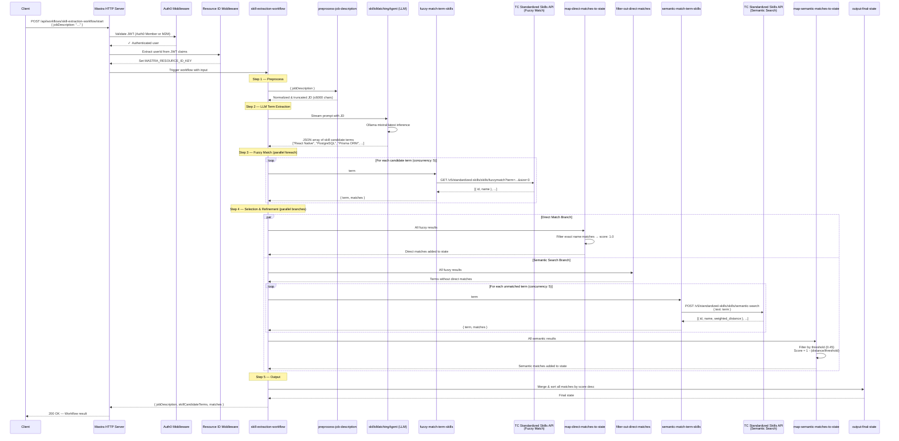
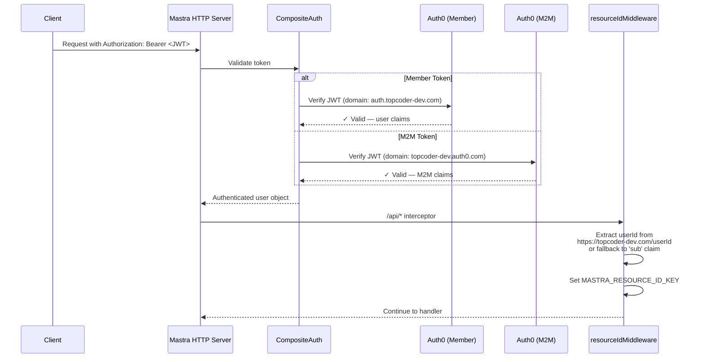
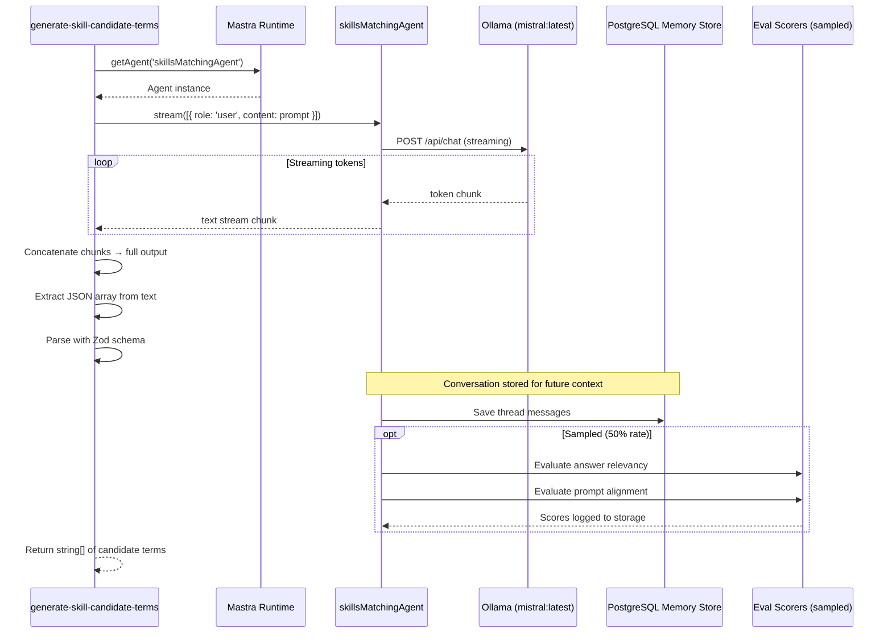

# tc-ai-api — Comprehensive Technical Documentation

## Table of Contents

1. [Overview](#overview)
2. [Technology Stack](#technology-stack)
3. [Project Structure](#project-structure)
4. [Environment Variables](#environment-variables)
5. [Framework Setup — Mastra](#framework-setup--mastra)
6. [Database Layer](#database-layer)
7. [Authentication & Middleware](#authentication--middleware)
8. [Observability & Logging](#observability--logging)
9. [AI Model Provider — Ollama](#ai-model-provider--ollama)
10. [Agents](#agents)
11. [Tools](#tools)
12. [Scorers (Evaluation)](#scorers-evaluation)
13. [Workflows — Skill Extraction](#workflows--skill-extraction)
14. [Challenges Vector RAG](#challenges-vector-rag)
15. [Sequence Diagrams](#sequence-diagrams)
16. [External API Interactions](#external-api-interactions)
17. [CI/CD Pipeline](#cicd-pipeline)
18. [Deployment](#deployment)

---

## Overview

**tc-ai-api** is a Topcoder AI microservice built on the [Mastra](https://mastra.ai) AI orchestration framework. Its primary capability today is **Skill Extraction** — given a free-text job description, it identifies and matches relevant skills against Topcoder's Standardized Skills taxonomy using a multi-stage pipeline that combines LLM-based term extraction, fuzzy matching, and semantic search.

The service exposes a Hono-based HTTP API (managed by Mastra's built-in server), is authenticated via Auth0 JWTs, uses PostgreSQL for storage and agent memory, runs local LLM inference through Ollama, and ships with built-in observability and evaluation scorers.

---

## Technology Stack

| Layer               | Technology                                                  |
| ------------------- | ----------------------------------------------------------- |
| **Runtime**         | Node.js ≥ 22.13.0 (`.nvmrc`: v24.13.0)                      |
| **Language**        | TypeScript 5.9+ (ES2022, ESM)                               |
| **Package Manager** | pnpm 10.28.0                                                |
| **AI Framework**    | Mastra (`@mastra/core` ^1.2.0)                              |
| **AI SDK**          | Vercel AI SDK (`ai` ^6.0.71)                                |
| **LLM Provider**    | Ollama via `ai-sdk-ollama` ^3.4.0                           |
| **HTTP Server**     | Hono (embedded in Mastra)                                   |
| **Database**        | PostgreSQL via `@mastra/pg` ^1.2.0                          |
| **Auth**            | Auth0 via `@mastra/auth-auth0` ^1.0.0                       |
| **Observability**   | OpenTelemetry via `@mastra/observability` ^1.2.0            |
| **Logging**         | Pino via `@mastra/loggers` ^1.0.1                           |
| **Evals**           | `@mastra/evals` ^1.1.0 (Answer Relevancy, Prompt Alignment) |
| **Schema**          | Zod 4.3+                                                    |
| **Linting**         | ESLint 9 + typescript-eslint                                |
| **Formatting**      | Prettier 3.8+                                               |
| **CI/CD**           | CircleCI → AWS ECS (Fargate)                                |
| **Container**       | Docker (node:24.13.0-alpine)                                |

---

## Project Structure

```
tc-ai-api/
├── .circleci/config.yml          # CircleCI build/deploy pipeline
├── .github/workflows/            # GitHub Actions (code reviewer)
├── .mastra/                      # Mastra build artifacts (git-ignored)
├── src/
│   ├── mastra/
│   │   ├── index.ts              # ★ Mastra instance — wires everything together
│   │   ├── agents/
│   │   │   └── skills/
│   │   │       └── skills-matching-agent.ts   # LLM agent for term extraction
│   │   ├── tools/
│   │   │   └── skills/
│   │   │       ├── standardized-skills-fuzzy-tool.ts    # Fuzzy-match API tool
│   │   │       └── standardized-skills-semantic-tool.ts # Semantic-search API tool
│   │   ├── workflows/
│   │   │   └── skills/
│   │   │       └── skill-extraction-workflow.ts  # ★ Main orchestration workflow
│   │   ├── scorers/
│   │   │   └── skills-matching-scorers.ts        # Evaluation scorers
│   │   └── public/                               # Static assets (empty)
│   └── utils/
│       ├── index.ts              # Barrel re-exports
│       ├── logger.ts             # Pino logger configuration
│       ├── auth/
│       │   └── index.ts          # Auth0 composite auth setup
│       ├── middleware/
│       │   ├── index.ts          # Middleware registration
│       │   └── resourceIdMiddleware.ts  # Resource isolation middleware
│       └── providers/
│           └── ollama.ts         # Ollama AI provider config
├── Dockerfile                    # Production container image
├── appStartUp.sh                 # Container entrypoint
├── package.json
├── tsconfig.json
├── eslint.config.mjs
├── .prettierrc / .prettierignore
└── .env                          # Local environment variables
```

---

## Environment Variables

| Variable                            | Required | Default                                | Description                                                      |
| ----------------------------------- | -------- | -------------------------------------- | ---------------------------------------------------------------- |
| `PORT`                              | No       | `3000`                                 | HTTP server port                                                 |
| `MASTRA_DB_CONNECTION`              | **Yes**  | —                                      | PostgreSQL connection string for Mastra storage and agent memory |
| `MASTRA_DB_SCHEMA`                  | No       | `ai`                                   | PostgreSQL schema name for Mastra tables                         |
| `TC_API_BASE`                       | **Yes**  | —                                      | Topcoder API base URL (e.g. `https://api.topcoder-dev.com`)      |
| `OLLAMA_API_URL`                    | No       | `http://ollama.topcoder-dev.com:11434` | Ollama API endpoint for LLM inference                            |
| `MASTRA_EVAL_MODEL`                 | No       | `mistral:latest`                       | Ollama model used for evaluation scorers                         |
| `AUTH0_DOMAIN`                      | Yes\*    | —                                      | Auth0 domain for member JWT validation                           |
| `AUTH0_AUDIENCE`                    | Yes\*    | —                                      | Auth0 audience (client ID) for member tokens                     |
| `AUTH0_M2M_DOMAIN`                  | Yes\*    | —                                      | Auth0 domain for M2M JWT validation                              |
| `AUTH0_M2M_AUDIENCE`                | Yes\*    | —                                      | Auth0 audience for M2M tokens                                    |
| `DISABLE_AUTH`                      | No       | `false`                                | Set to `"true"` to disable all authentication (dev mode)         |
| `JD_MAX_CHARS`                      | No       | `6000`                                 | Max character length for job description preprocessing           |
| `SKILL_MATCHING_FUZZY_MATCH_SIZE`   | No       | `3`                                    | Number of candidates returned per fuzzy-match query              |
| `SKILL_MATCHING_CONCURRENCY`        | No       | `5`                                    | Concurrency limit for parallel skill-matching requests           |
| `SKILL_MATCHING_SEMANTIC_THRESHOLD` | No       | `0.45`                                 | Max cosine distance for semantic matches (lower = stricter)      |
| `SKILL_DISCOVERY_EVAL_SAMPLE_RATE`  | No       | -                                      | Fraction of agent interactions sampled for evaluation scoring    |
| `RAG_EMBEDDING_PROVIDER`            | No       | `TC-Ollama`                            | Embedding provider for challenge RAG (`TC-Ollama` \| `AWSBedrock`) |
| `RAG_EMBEDDING_MODEL_ID`            | No       | `nomic-embed-text`                     | Embedding model id (768d locally; `amazon.titan-embed-text-v2:0`, 1024d, in prod) |
| `VECTOR_INDEX_NAME`                 | No       | `challenge_embeddings`                 | Vector table name (SQL-identifier validated) — override per environment when reindexing |
| `VECTOR_SEARCH_THRESHOLD`           | No       | `0.5`                                  | Minimum similarity score, applied after retrieval                |
| `RAG_CHUNK_MAX_SIZE`                | No       | `512`                                  | Max characters per chunk before recursive splitting               |
| `RAG_CHUNK_OVERLAP`                 | No       | `50`                                   | Character overlap between recursively-split chunks                |
| `RAG_TOP_K`                         | No       | `10`                                   | Default result count for challenge vector search                  |
| `CHALLENGE_SEARCH_AI_PROVIDER`      | No       | `AWSBedrock`                           | Model provider for `challenge-search-agent`                       |
| `CHALLENGE_SEARCH_AI_MODEL_ID`      | No       | `us.anthropic.claude-haiku-4-5`        | Model id for `challenge-search-agent`                              |

> \* Auth0 variables are required unless `DISABLE_AUTH=true`.

---

## Framework Setup — Mastra

The application is bootstrapped in `src/mastra/index.ts` by instantiating a single `Mastra` object that wires together every subsystem:

```typescript
export const mastra = new Mastra({
  workflows:    { skillExtractionWorkflow },
  agents:       { skillsMatchingAgent },
  scorers:      { ...evalScorers },
  storage:      new PostgresStore({ connectionString, schemaName }),
  logger:       tcAILogger,          // Pino
  observability: new Observability({...}),  // OpenTelemetry
  server: {
    port: 3000,
    auth: apiAuthLayer,              // CompositeAuth (Auth0)
    middleware: middlewareConfig,     // resourceIdMiddleware
  },
});
```

### NPM Scripts

| Script         | Command              | Description                                                     |
| -------------- | -------------------- | --------------------------------------------------------------- |
| `dev`          | `mastra dev`         | Start dev server with hot-reload and Mastra Studio at `/studio` |
| `build`        | `mastra build`       | Production build (bundles into `.mastra/output/`)               |
| `start`        | `mastra start`       | Start production server from build output                       |
| `studio`       | `mastra studio`      | Launch Mastra Studio UI standalone                              |
| `lint`         | `eslint .`           | Run ESLint across the project                                   |
| `lint:fix`     | `eslint . --fix`     | Auto-fix lint issues                                            |
| `format`       | `prettier . --write` | Format all files                                                |
| `format:check` | `prettier . --check` | Check formatting without writing                                |

---

## Database Layer

### Storage Backend: PostgreSQL (`@mastra/pg`)

The application uses a **single PostgreSQL database** with a configurable schema (default: `ai`). Two `PostgresStore` instances are created:

1. **Global Mastra Storage** (`src/mastra/index.ts`)
   - ID: `tc-ai-api-store`
   - Stores: workflow run state, step execution logs, evaluation results, and general Mastra metadata.

2. **Agent Memory Storage** (`src/mastra/agents/skills/skills-matching-agent.ts`)
   - ID: `skills-matching-agent-memory`
   - Stores: conversation threads and message history for the `skillsMatchingAgent`, enabling multi-turn memory when interacting with the agent directly.

Both point to the same connection string (`MASTRA_DB_CONNECTION`) and schema (`MASTRA_DB_SCHEMA`), but are logically separate stores within Mastra's storage abstraction.

### Schema Management

Mastra automatically manages table creation and migrations within the configured PostgreSQL schema. No manual migration steps are required.

### Connection String Format

```
postgresql://<user>:<password>@<host>:<port>/<database>?schema=<schema>
```

---

## Authentication & Middleware

### Auth0 Composite Authentication

Authentication is handled by `CompositeAuth` from `@mastra/core/server`, which evaluates incoming JWTs against **two** Auth0 tenants:

1. **Member tokens** — issued by `AUTH0_DOMAIN` with audience `AUTH0_AUDIENCE`
2. **M2M (machine-to-machine) tokens** — issued by `AUTH0_M2M_DOMAIN` with audience `AUTH0_M2M_AUDIENCE`

A request is authorized if it passes validation against **either** tenant.

Authentication can be fully disabled by setting `DISABLE_AUTH=true` (useful for local development).

### Resource ID Middleware

When auth is enabled, the `resourceIdMiddleware` intercepts all `/api/*` requests and:

1. Extracts the authenticated `user` object from the request context.
2. Derives the Topcoder domain from `TC_API_BASE` (e.g., `topcoder-dev.com`).
3. Reads the user ID from the JWT claim `https://<domain>/userId`, falling back to `sub` for M2M tokens.
4. Sets `MASTRA_RESOURCE_ID_KEY` in the request context, scoping all subsequent Mastra operations (memory, threads, state) to that user.

This ensures **resource isolation** — each user's agent memory and workflow state are segregated.

---

## Observability & Logging

### Logging

A Pino logger (`@mastra/loggers`) is configured at `info` level with the service name `TC AI API`. It is injected into the Mastra instance and made available to all agents, tools, and workflow steps via context.

### Observability (OpenTelemetry)

The `@mastra/observability` package provides:

- **DefaultExporter** — exports spans to the configured OTLP endpoint.
- **SensitiveDataFilter** — a span output processor that redacts sensitive data from telemetry.
- Service name: `tc-ai-api`

All agent interactions, tool executions, and workflow step runs are automatically instrumented.

---

## AI Model Provider — Ollama

LLM inference runs through a self-hosted [Ollama](https://ollama.com) instance. The provider is configured in `src/utils/providers/ollama.ts`:

```typescript
export const ollama = createOllama({
  baseURL: process.env.OLLAMA_API_URL || 'http://ollama.topcoder-dev.com:11434',
});
```

The default model is `mistral:latest` with conservative generation parameters:

| Parameter        | Value | Purpose                                                   |
| ---------------- | ----- | --------------------------------------------------------- |
| `temperature`    | 0.1   | Near-deterministic output for consistent skill extraction |
| `top_p`          | 0.5   | Nucleus sampling cutoff                                   |
| `repeat_penalty` | 1.1   | Reduces repetitive outputs                                |
| `num_predict`    | 2048  | Maximum tokens to generate                                |

---

## Agents

### `skillsMatchingAgent`

| Property    | Value                                        |
| ----------- | -------------------------------------------- |
| **ID**      | `skillsMatchingAgent`                        |
| **Model**   | `ollama('mistral:latest')`                   |
| **Memory**  | PostgreSQL-backed conversation memory        |
| **Scorers** | Answer Relevancy, Prompt Alignment (sampled) |

**System Prompt Behavior:**

The agent is instructed to:

- Parse free text (job descriptions, resumes, etc.) to identify skill candidates.
- Prioritize specific multi-word terms (e.g., "React Native" over "React").
- Aggressively split combined technologies (e.g., "PostgreSQL with Prisma ORM" → two separate terms).
- Output strict JSON arrays of strings — no prose, no markdown.

The agent is used within the workflow's `generateSkillCandidateTerms` step via its `.stream()` method, producing incremental text output that is then parsed into a JSON array.

---

## Tools

### `standardized-skills-fuzzy-match`

| Property   | Value                                                        |
| ---------- | ------------------------------------------------------------ |
| **ID**     | `standardized-skills-fuzzy-match`                            |
| **API**    | `GET {TC_API_BASE}/v5/standardized-skills/skills/fuzzymatch` |
| **Input**  | `{ term: string, size?: number }`                            |
| **Output** | `{ matches: [{ id: string, name: string }] }`                |

Performs fuzzy string matching against Topcoder's standardized skills taxonomy. Returns up to `size` matches for the given term.

### `standardized-skills-semantic-search`

| Property   | Value                                                                    |
| ---------- | ------------------------------------------------------------------------ |
| **ID**     | `standardized-skills-semantic-search`                                    |
| **API**    | `POST {TC_API_BASE}/v5/standardized-skills/skills/semantic-search`       |
| **Input**  | `{ text: string }`                                                       |
| **Output** | `{ matches: [{ id: string, name: string, weighted_distance: number }] }` |

Performs vector-based semantic search against the skills taxonomy. Returns matches ranked by cosine distance.

---

## Scorers (Evaluation)

Two LLM-based scorers evaluate agent output quality at runtime (sampled):

### `skillDiscoveryAnswerRelevancyScorer`

Uses `createAnswerRelevancyScorer` from `@mastra/evals`. Measures whether the agent's response is relevant to the user's input query.

### `skillDiscoveryPromptAlignmentScorer`

Uses `createPromptAlignmentScorerLLM` from `@mastra/evals`. Measures whether the agent's response adheres to the system prompt instructions (evaluation mode: `user`).

Both scorers run on the same Ollama model (`MASTRA_EVAL_MODEL`, default `mistral:latest`) and are sampled at a configurable rate (`SKILL_DISCOVERY_EVAL_SAMPLE_RATE`, default 50%).

---

## Workflows — Skill Extraction

The core business logic lives in `skill-extraction-workflow.ts`, organized as a **main workflow** with **nested sub-workflows**.

### Workflow: `skill-extraction-workflow` (Main)

**Input:** `{ jobDescription: string }`  
**Output:** `{ jobDescription, matches: [{ id, name, score }], skillCandidateTerms: string[] }`

#### Step Pipeline

| #   | Step ID                                            | Description                                                                   |
| --- | -------------------------------------------------- | ----------------------------------------------------------------------------- |
| 1   | `preprocess-job-description`                       | Normalize whitespace and truncate to `JD_MAX_CHARS` (default 6000)            |
| 2   | `generate-skill-candidate-terms`                   | Use `skillsMatchingAgent` (LLM) to extract skill search terms as a JSON array |
| 3   | `fuzzy-match-term-skills` (foreach)                | For each candidate term, call the fuzzy-match API tool (concurrency: 5)       |
| 4   | `skill-selection-and-refinement-workflow` (nested) | Split results into direct matches vs. terms needing semantic search           |
| 5   | `output-final-state`                               | Sort all matches by score (descending) and return final state                 |

### Sub-Workflow: `skill-selection-and-refinement-workflow`

Runs two branches **in parallel**:

| Branch              | Steps                                                                                                 |
| ------------------- | ----------------------------------------------------------------------------------------------------- |
| **Direct Match**    | `map-direct-matches-to-state` — Skills with exact name match get `score: 1.0`                         |
| **Semantic Search** | `filter-out-direct-matches` → `foreach(semantic-match-term-skills)` → `map-semantic-matches-to-state` |

### Scoring Logic

- **Direct matches** (fuzzy match name === search term, case-insensitive): `score = 1.0`
- **Semantic matches**: `score = max(0, min(1, 1 - (weighted_distance / threshold)))` where threshold defaults to `0.45`. Matches above the threshold are discarded.

---

## Challenges Vector RAG

Retrieval-Augmented Generation over Topcoder challenge descriptions: an ingestion pipeline that chunks and embeds challenge text into `pgvector`, and a retrieval surface exposed both as an LLM-backed agent and as a deterministic, LLM-free workflow. Ported from the `tc-challenges-vector-rag` prototype (see [ADR 0001](docs/adr/0001-integrate-challenges-vector-rag.md) for the full design record and rationale — decisions below are cited as `D#`).

### Overview

| Concern | Summary |
| --- | --- |
| **Vector store** | `PgVector` (`@mastra/pg`), same `MASTRA_DB_CONNECTION` database and `MASTRA_DB_SCHEMA` as the rest of Mastra (D3) — no new infrastructure. |
| **Embeddings** | Provider-switched: Ollama `nomic-embed-text` (768d) locally, AWS Bedrock `amazon.titan-embed-text-v2:0` (1024d) in production (D2). |
| **Ingestion source** | Primary: the Challenge Search API (`GET /v6/challenges`), via `searchChallengesTool` and the `challenge-bulk-ingestion` workflow (D11). Secondary: CSV backfill CLI, for offline/air-gapped environments. |
| **Retrieval** | Two paths sharing one tool (`challengeVectorQueryTool`) so they cannot diverge: `challenge-search-agent` (synthesised NL answers) and `challenge-search` workflow (raw ranked results, no LLM) (D8). |
| **Project scoping** | Vector metadata carries only an opaque `projectId` reference — no project attributes are denormalized in. Callers resolve project detail via a separate `GET /v6/projects/:projectId` call (D10). |

### Ingestion

**`challenge-ingestion`** (workflow) — ingests one challenge, by `challengeId` (fetched via `fetchChallengeTool`) or an inline record:

1. `resolve-challenge` — fetch or validate the inline record; `projectId` is carried through as a string reference only, never dereferenced (D10).
2. `chunk-and-embed` — `processDescription` (line-ending normalization, BOM-aware trim, HTML→Markdown, frontmatter strip) → `chunkChallengeDescription` (two-pass chunking, see below) → `enrichChunksWithChallengeName` → `embedMany` via the embedding-provider factory, wrapped in retry-with-backoff.
3. `upsert-vectors` — `ensureChallengeIndex()` (idempotent create/dimension-guard, D7), then `upsert({ deleteFilter: { challengeId } })` — delete-then-insert as one transaction, so a challenge is never left partially indexed.

Only the challenge's **public** `description` is ever embedded — `privateDescription` is never read by the ingestion path.

**`challenge-bulk-ingestion`** (workflow, D11) — paginates `searchChallengesTool` (filterable by `projectId`/`projectIds`, `status`, `types`, `tracks`, `tags`, `groups`, `updatedDateStart` for incremental sync) and fans out to `challenge-ingestion` per challenge with bounded concurrency (default 3). One bad challenge cannot abort the run — failures are captured per-challenge in the aggregated report.

**CLI (secondary path, D11):**

```bash
# CSV backfill — offline/air-gapped environments, or CSV exports that predate the search API
pnpm run ingest -- --file path/to/challenges.csv [--dry-run]
pnpm run ingest -- --folder path/to/csvs
pnpm run ingest -- --clear-all --folder path/to/csvs   # confirms, then drops the vector index

# Incremental sync / project-scoped backfill — thin wrapper around challenge-bulk-ingestion
pnpm run sync -- --project-id 17423 [--dry-run]
pnpm run sync -- --status ACTIVE --updated-since 2026-08-01 --concurrency 5
```

Both CLIs invoke the same workflows the API exposes (via `mastra.getWorkflowById(...).createRun().start(...)`), so the CLI and API paths cannot drift onto separate implementations. `ingest-challenges.ts` writes per-run logs to `logs/ingestion-<timestamp>/{output.log,error.log,report.json}` (git-ignored).

### Retrieval

- **`challengeVectorQueryTool`** — the shared retrieval primitive. Composes an `$and` metadata filter from `skills` (`$in`), `type`/`track` (`$eq`, free-form strings per D12 — not enums), `groups` (`$in`), and `projectId` (`$in`, D10). `query` is optional: with at least one filter and no query text, it performs a metadata-only lookup (`query({ filter })`, no `queryVector`) — e.g. "everything indexed for project 17423". The relevance threshold (`VECTOR_SEARCH_THRESHOLD`) is applied **after** retrieval in application code rather than passed to `query({ minScore })`, because passing `minScore` forces `@mastra/pg` off the HNSW ANN fast path onto a full exact scan.
- **`challenge-search-agent`** ("Topcoder Challenge Assistant") — infers `skills`/`type`/`track`/`groups` filters from natural language and calls the tool. Never infers `projectId` from the query text — that must come from the caller's context, and **scope filters must be enforced server-side**, not left to the model (see the ADR's security note).
- **`challenge-search`** (workflow, D8) — the deterministic, LLM-free path: same tool, same filter composition, so results cannot diverge from the agent path. Input adds `groupBy` (`chunk` | `challenge` | `project`, default `challenge`): `chunk` returns raw hits ungrouped; `challenge` groups hits by `challengeId` (best chunk score becomes the challenge score, contributing chunks listed underneath); `project` rolls the same hits up by `projectId`.
- **`fetchProjectTool`** (optional, D10) — retrieval-time enrichment: resolves a `projectId` from a hit to project name/status/tech stack via `GET /v6/projects/:projectId`, under the caller's own authorization. Not used by, and nothing in, the ingestion or retrieval path depends on it.

### Chunking strategy

Two-pass, mirroring the source prototype:

1. **Markdown-header pass** — splits on `#`/`##` headers, keeping code blocks and tables as atomic units.
2. **Size-based pass** — chunks over `RAG_CHUNK_MAX_SIZE` (default 512 chars) are recursively split (`RAG_CHUNK_OVERLAP`, default 50). Atomic blocks (code/tables) are kept intact if they fit the embedding model's context window; if an atomic block still exceeds it, it is force-split and reported (`forceSplits` in every ingestion report) — a rare safety fallback, not expected in real Topcoder data.

### Metadata schema

Every row is one challenge chunk. There is no separate text column — the chunk text lives in `metadata.text` (named `text`, not the prototype's `content`, to match `@mastra/rag`'s convention — see ADR 0001 for the full rationale):

| Field | Type | Notes |
| --- | --- | --- |
| `challengeId` | `string` | The `deleteFilter` key for per-challenge replacement. |
| `name` | `string` | Challenge title. |
| `type` | `string` | Free-form (`ChallengeType` reference table, D12) — not an enum. |
| `track` | `string` | Free-form (`ChallengeTrack.name`, D12) — not an enum. |
| `skills` | `string[]` | Filterable via `$in`. |
| `groups` | `string[]` | Filterable via `$in`. |
| `projectId` | `string \| null` | The **only** project field (D10). Stored as a string — `@mastra/pg` compares metadata scalars as text. |
| `chunkIndex` / `totalChunks` | `number` | 1-based position / total chunk count, for reassembly. |
| `text` | `string` | The chunk text, prefixed with `# Challenge: <name>`. |
| `ingestedAt` | `string` | ISO-8601. Compensates for Mastra's table having no `created_at` column. |

### Embedding models

| Provider | Model | Dimension | Context window | Use |
| --- | --- | --- | --- | --- |
| `TC-Ollama` | `nomic-embed-text` | 768 | 2048 | Local development default |
| `AWSBedrock` | `amazon.titan-embed-text-v2:0` | 1024 | 8192 | Production default |

Switching a given environment's embedding provider requires a full reindex — `VECTOR_INDEX_NAME` is environment-overridable, and `ensureChallengeIndex()` throws an actionable error if the configured model's dimension doesn't match an existing index (D7).

### Database bootstrap

Per D3, there is **no hand-maintained DDL script** — `PgVector.createIndex()` performs all schema/table/index creation on first use (schema, table, HNSW vector index, and btree `metadataIndexes` on `challengeId`/`projectId`/`track`). This assumes the `vector` extension is enabled and the runtime database role holds DDL privileges. Local development uses the same `docker/docker-compose.yml` (`pgvector/pgvector:pg16`) as the rest of the project — no separate `init-db` step.

---

## Sequence Diagrams

### Skill Extraction Workflow — End-to-End


```mermaid
sequenceDiagram
    participant Client
    participant MastraServer as Mastra HTTP Server
    participant Auth as Auth0 Middleware
    participant ResID as Resource ID Middleware
    participant WF as skill-extraction-workflow
    participant PreProc as preprocess-job-description
    participant Agent as skillsMatchingAgent (LLM)
    participant FuzzyStep as fuzzy-match-term-skills
    participant FuzzyAPI as TC Standardized Skills API<br/>(Fuzzy Match)
    participant DirectMap as map-direct-matches-to-state
    participant FilterStep as filter-out-direct-matches
    participant SemanticStep as semantic-match-term-skills
    participant SemanticAPI as TC Standardized Skills API<br/>(Semantic Search)
    participant SemanticMap as map-semantic-matches-to-state
    participant Output as output-final-state

    Client->>MastraServer: POST /api/workflows/skill-extraction-workflow/start<br/>{ jobDescription: "..." }
    MastraServer->>Auth: Validate JWT (Auth0 Member or M2M)
    Auth-->>MastraServer: ✓ Authenticated user
    MastraServer->>ResID: Extract userId from JWT claims
    ResID-->>MastraServer: Set MASTRA_RESOURCE_ID_KEY
    MastraServer->>WF: Trigger workflow with input

    Note over WF: Step 1 — Preprocess
    WF->>PreProc: { jobDescription }
    PreProc-->>WF: Normalized & truncated JD (≤6000 chars)

    Note over WF: Step 2 — LLM Term Extraction
    WF->>Agent: Stream prompt with JD
    Agent->>Agent: Ollama mistral:latest inference
    Agent-->>WF: JSON array of skill candidate terms<br/>["React Native", "PostgreSQL", "Prisma ORM", ...]

    Note over WF: Step 3 — Fuzzy Match (parallel foreach)
    loop For each candidate term (concurrency: 5)
        WF->>FuzzyStep: term
        FuzzyStep->>FuzzyAPI: GET /v5/standardized-skills/skills/fuzzymatch?term=...&size=3
        FuzzyAPI-->>FuzzyStep: [{ id, name }, ...]
        FuzzyStep-->>WF: { term, matches }
    end

    Note over WF: Step 4 — Selection & Refinement (parallel branches)

    par Direct Match Branch
        WF->>DirectMap: All fuzzy results
        DirectMap->>DirectMap: Filter exact name matches → score: 1.0
        DirectMap-->>WF: Direct matches added to state
    and Semantic Search Branch
        WF->>FilterStep: All fuzzy results
        FilterStep-->>WF: Terms without direct matches
        loop For each unmatched term (concurrency: 5)
            WF->>SemanticStep: term
            SemanticStep->>SemanticAPI: POST /v5/standardized-skills/skills/semantic-search<br/>{ text: term }
            SemanticAPI-->>SemanticStep: [{ id, name, weighted_distance }, ...]
            SemanticStep-->>WF: { term, matches }
        end
        WF->>SemanticMap: All semantic results
        SemanticMap->>SemanticMap: Filter by threshold (0.45)<br/>Score = 1 - (distance/threshold)
        SemanticMap-->>WF: Semantic matches added to state
    end

    Note over WF: Step 5 — Output
    WF->>Output: Merge & sort all matches by score desc
    Output-->>WF: Final state

    WF-->>MastraServer: { jobDescription, skillCandidateTerms, matches }
    MastraServer-->>Client: 200 OK — Workflow result
```

### Authentication Flow


```mermaid
sequenceDiagram
    participant Client
    participant Server as Mastra HTTP Server
    participant CompositeAuth as CompositeAuth
    participant MemberAuth as Auth0 (Member)
    participant M2MAuth as Auth0 (M2M)
    participant ResMiddleware as resourceIdMiddleware

    Client->>Server: Request with Authorization: Bearer <JWT>
    Server->>CompositeAuth: Validate token

    alt Member Token
        CompositeAuth->>MemberAuth: Verify JWT (domain: auth.topcoder-dev.com)
        MemberAuth-->>CompositeAuth: ✓ Valid — user claims
    else M2M Token
        CompositeAuth->>M2MAuth: Verify JWT (domain: topcoder-dev.auth0.com)
        M2MAuth-->>CompositeAuth: ✓ Valid — M2M claims
    end

    CompositeAuth-->>Server: Authenticated user object

    Server->>ResMiddleware: /api/* interceptor
    ResMiddleware->>ResMiddleware: Extract userId from<br/>https://topcoder-dev.com/userId<br/>or fallback to 'sub' claim
    ResMiddleware->>ResMiddleware: Set MASTRA_RESOURCE_ID_KEY
    ResMiddleware-->>Server: Continue to handler
```

### Agent Interaction — Term Extraction Detail


```mermaid
sequenceDiagram
    participant WorkflowStep as generate-skill-candidate-terms
    participant Mastra as Mastra Runtime
    participant Agent as skillsMatchingAgent
    participant Ollama as Ollama (mistral:latest)
    participant Memory as PostgreSQL Memory Store
    participant Scorer as Eval Scorers (sampled)

    WorkflowStep->>Mastra: getAgent('skillsMatchingAgent')
    Mastra-->>WorkflowStep: Agent instance

    WorkflowStep->>Agent: stream([{ role: 'user', content: prompt }])
    Agent->>Ollama: POST /api/chat (streaming)

    loop Streaming tokens
        Ollama-->>Agent: token chunk
        Agent-->>WorkflowStep: text stream chunk
    end

    WorkflowStep->>WorkflowStep: Concatenate chunks → full output
    WorkflowStep->>WorkflowStep: Extract JSON array from text
    WorkflowStep->>WorkflowStep: Parse with Zod schema

    Note over Agent,Memory: Conversation stored for future context
    Agent->>Memory: Save thread messages

    opt Sampled (50% rate)
        Agent->>Scorer: Evaluate answer relevancy
        Agent->>Scorer: Evaluate prompt alignment
        Scorer-->>Agent: Scores logged to storage
    end

    WorkflowStep-->>WorkflowStep: Return string[] of candidate terms
```

---

## External API Interactions

The service communicates with the following external systems:

### 1. Topcoder Standardized Skills API

| Endpoint                                                             | Method | Purpose                                           | Called By                        |
| -------------------------------------------------------------------- | ------ | ------------------------------------------------- | -------------------------------- |
| `{TC_API_BASE}/v5/standardized-skills/skills/fuzzymatch?term=&size=` | `GET`  | Fuzzy string matching against the skills taxonomy | `standardizedSkillsFuzzyTool`    |
| `{TC_API_BASE}/v5/standardized-skills/skills/semantic-search`        | `POST` | Vector-based semantic search (`{ text }` body)    | `standardizedSkillsSemanticTool` |

These are **unauthenticated** calls (no bearer token forwarded). The API base URL is configured via `TC_API_BASE`.

### 2. Ollama LLM API

| Endpoint                    | Method | Purpose                                         | Called By                          |
| --------------------------- | ------ | ----------------------------------------------- | ---------------------------------- |
| `{OLLAMA_API_URL}/api/chat` | `POST` | Streaming chat completion with `mistral:latest` | `skillsMatchingAgent` (via AI SDK) |
| `{OLLAMA_API_URL}/api/chat` | `POST` | Evaluation model inference                      | Evaluation scorers                 |

### 3. Auth0

| Endpoint                                           | Purpose                            |
| -------------------------------------------------- | ---------------------------------- |
| `https://{AUTH0_DOMAIN}/.well-known/jwks.json`     | JWKS for member token verification |
| `https://{AUTH0_M2M_DOMAIN}/.well-known/jwks.json` | JWKS for M2M token verification    |

### 4. PostgreSQL

| Purpose                                 | Connection                                          |
| --------------------------------------- | --------------------------------------------------- |
| Workflow state, step logs, eval results | `MASTRA_DB_CONNECTION` (schema: `MASTRA_DB_SCHEMA`) |
| Agent conversation memory (threads)     | Same connection, same schema                        |

---

## CI/CD Pipeline

### CircleCI (`.circleci/config.yml`)

The project uses CircleCI for automated builds and deployments:

| Job          | Branch    | Environment | Target          |
| ------------ | --------- | ----------- | --------------- |
| `build-dev`  | `develop` | DEV         | AWS ECS Fargate |
| `build-prod` | `master`  | PROD        | AWS ECS Fargate |

**Pipeline Steps:**

1. Checkout code
2. Set up remote Docker
3. Install AWS CLI and Topcoder deploy scripts (`tc-deploy-scripts` v1.4.19)
4. Build Docker image: `docker buildx build --no-cache=true -t tc-ai-api:latest .`
5. Configure AWS environment
6. Process parameter store variables
7. Deploy to ECS Fargate via `master_deploy.sh`

### GitHub Actions (`.github/workflows/code_reviewer.yml`)

A code review automation workflow (details in the workflow file).

---

## Deployment

### Docker

The production Dockerfile:

```dockerfile
FROM node:24.13.0-alpine
WORKDIR /app
COPY . .
RUN npm install pnpm -g
RUN pnpm install
RUN pnpm run lint
RUN pnpm run build
CMD ./appStartUp.sh    # → pnpm start → mastra start
```

The container runs the Mastra production server on the configured `PORT` (default 3000).

### Infrastructure

- **Compute:** AWS ECS Fargate
- **Configuration:** AWS Systems Manager Parameter Store (`/config/tc-ai-api/`)
- **Scaling:** Managed by ECS service configuration
- **LLM:** Self-hosted Ollama instance (internal network at `ollama.topcoder-dev.com:11434` or local)

---

## API Surface (Auto-generated by Mastra)

Mastra automatically exposes the following REST endpoints:

| Endpoint                                          | Method | Description                              |
| ------------------------------------------------- | ------ | ---------------------------------------- |
| `/api/workflows/skill-extraction-workflow/start`  | `POST` | Start the skill extraction workflow      |
| `/api/workflows/skill-extraction-workflow/:runId` | `GET`  | Get workflow run status/result           |
| `/api/agents/skillsMatchingAgent/generate`        | `POST` | Direct agent text generation             |
| `/api/agents/skillsMatchingAgent/stream`          | `POST` | Direct agent streaming generation        |
| `/api/workflows/challenge-ingestion/start`        | `POST` | Ingest one challenge by id or inline record |
| `/api/workflows/challenge-bulk-ingestion/start`   | `POST` | Paginated bulk / incremental-sync ingestion |
| `/api/workflows/challenge-search/start`           | `POST` | Deterministic ranked challenge search (no LLM) |
| `/api/agents/challengeSearchAgent/generate`       | `POST` | Synthesised NL challenge search           |
| `/api/agents/challengeSearchAgent/stream`         | `POST` | Synthesised NL challenge search (streaming) |
| `/studio/*`                                       | `GET`  | Mastra Studio UI (development/debugging) |

All `/api/*` endpoints are protected by Auth0 authentication (unless `DISABLE_AUTH=true`) and scoped by the resource ID middleware.
