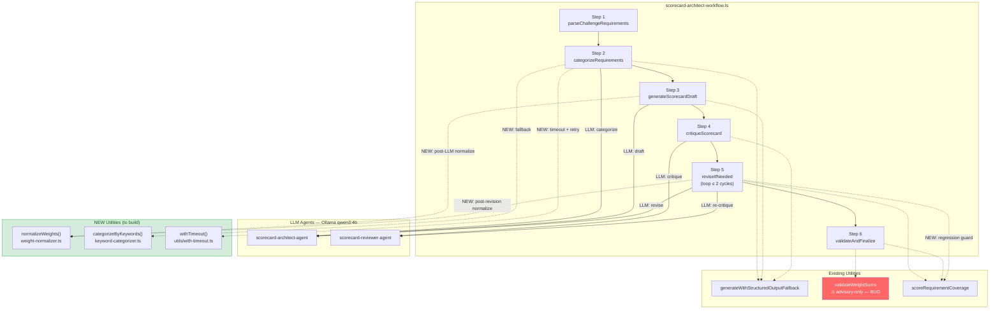
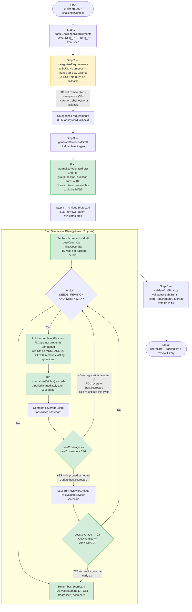

# Scorecard Architect Workflow — Fix Plan (TDD)

> **Trace analyzed:** `docs/traces/unknown.json` — run `2026-04-22T09:16:43Z`
> **Workflow:** `scorecard-architect` (`tc-ai-api`)
> **Final coverage:** 16.6% (2/12 requirements mapped) — quality degraded across revision cycles

---

## High-Level Architecture



---

## Workflow Execution Flowchart (Current Bugs → Fixed)



---

## Root Cause Analysis

| #   | Symptom (from trace)                             | Root Cause                                                                                                   | Fix                                                                |
| --- | ------------------------------------------------ | ------------------------------------------------------------------------------------------------------------ | ------------------------------------------------------------------ |
| 1   | Final output: 2/12 requirements (16.6%)          | Revision cycle 2 **regressed** to a 2-question scorecard; no best-scorecard tracking — always returns latest | Regression guard + `bestScorecard` / `bestCoverage` tracking       |
| 2   | Weights: group=10, section=5, questions 5+5      | `validateWeightSums` is advisory-only — logs warnings but takes no corrective action                         | `normalizeWeights()` applied post-LLM at draft and each revision   |
| 3   | `categorizeRequirements` hangs on local Ollama   | No timeout, no retry, no fallback — single blocking LLM call                                                 | `withTimeout` + keyword-based deterministic fallback               |
| 4   | Architect drops all 17 questions in cycle 2      | Revision prompt contains no "preserve existing questions" constraint; no unmapped req list provided          | Prompt hardening: prepend MUST-ADD list + DO NOT remove constraint |
| 5   | Reviewer hallucinates contradictory weight rules | Reviewer receives a malformed scorecard (group weight=10 vs expected 100) and invents rules                  | Weight normalization before critique eliminates bad input          |

---

## Implementation Plan

### Phase 1 — Weight Normalizer _(pure utility, zero LLM)_

**New file:** `src/mastra/workflows/scorecard/weight-normalizer.ts`

```typescript
// normalizeWeights(scorecard): GeneratedScorecard
// Pure function — proportional scaling at each level.
// Edge: all-zero weights → equal distribution.
```

**Tests first** → `src/mastra/workflows/scorecard/__tests__/weight-normalizer.test.ts`

| Test                           | Input                                | Expected                                |
| ------------------------------ | ------------------------------------ | --------------------------------------- |
| Single group wrong weight      | `[{weight:10}]`                      | `[{weight:100}]`                        |
| Two groups proportional        | `[{weight:20},{weight:80}]`          | unchanged                               |
| Questions sum wrong            | `[{weight:5},{weight:5}]`            | `[{weight:50},{weight:50}]`             |
| All-zero weights               | `[{weight:0},{weight:0},{weight:0}]` | `[{weight:33},{weight:33},{weight:34}]` |
| Single question                | `[{weight:42}]`                      | `[{weight:100}]`                        |
| Exact bad scorecard from trace | group=10, section=5, q=[5,5]         | group=100, section=100, q=[50,50]       |

**Integration** in `scorecard-architect-workflow.ts`:

- After `generateScorecardDraft` LLM response → `scorecard = normalizeWeights(scorecard)`
- After each `runArchitectRevision` response → `currentScorecard = normalizeWeights(currentScorecard)`
- Export `normalizeWeights` via `_testing`

---

### Phase 2 — Regression Guard + Best Scorecard Tracking

**Tests first** → add to `__tests__/scorecard-architect-workflow.test.ts`

- `reviseIfNeeded` keeps `bestScorecard` when cycle 2 regresses coverage below `bestCoverage × 0.9`
- `reviseIfNeeded` updates `bestScorecard` when cycle improves coverage
- Final output scorecard equals `bestScorecard`, not the latest revision

**Implementation changes in `reviseIfNeeded` step:**

```
BEFORE loop:
  initialCoverage = scoreRequirementCoverage({ requirementIds, scorecard, challengeDescription })
  bestScorecard    = inputData.scorecard
  bestCoverage     = initialCoverage.coverageScore

IN loop, after normalizeWeights:
  newCovResult = scoreRequirementCoverage({ requirementIds, scorecard: currentScorecard, ... })
  if newCovResult.coverageScore < bestCoverage * REGRESSION_TOLERANCE:
      warn "Regression detected cycle N — reverting to bestScorecard"
      currentScorecard = bestScorecard   // revert
      // skip reviewer re-critique this cycle, continue loop counter
  else:
      bestScorecard = currentScorecard
      bestCoverage  = newCovResult.coverageScore
      // run reviewer re-critique as before

AFTER loop:
  return { ...output, scorecard: bestScorecard }
```

- New constant: `const REGRESSION_TOLERANCE = 0.9`
- Export via `_testing`

---

### Phase 3 — Coverage Quality Gate

_Depends on Phase 2._

**Tests first:**

- Loop exits early when `coverageScore >= MIN_COVERAGE_THRESHOLD` AND `verdict === 'APPROVED'`
- Loop does NOT exit early when coverage < threshold even if verdict is `'APPROVED'`

**Implementation:**

```typescript
const MIN_COVERAGE_THRESHOLD = Number(process.env.SCORECARD_MIN_COVERAGE ?? 0.8);

// After re-critique in loop:
if (currentVerdict.verdict === 'APPROVED' && bestCoverage >= MIN_COVERAGE_THRESHOLD) break;
```

- Export `MIN_COVERAGE_THRESHOLD` via `_testing`

---

### Phase 4 — `categorizeRequirements` Timeout + Keyword Fallback

_Independent of Phases 1–3._

**New file:** `src/utils/with-timeout.ts`

```typescript
export class TimeoutError extends Error {
  readonly code = 'TIMEOUT';
  constructor(label?: string) {
    super(`Timeout${label ? ': ' + label : ''}`);
  }
}

export function withTimeout<T>(promise: Promise<T>, ms: number, label?: string): Promise<T> {
  return Promise.race([
    promise,
    new Promise<never>((_, reject) => setTimeout(() => reject(new TimeoutError(label)), ms)),
  ]);
}
```

**Tests first** → `src/utils/__tests__/with-timeout.test.ts`

- Resolves with value when promise completes before timeout
- Rejects with `TimeoutError` (`.code === 'TIMEOUT'`) when exceeded
- Does not leave dangling timers (use `vi.useFakeTimers()`)

**New file:** `src/mastra/workflows/scorecard/keyword-categorizer.ts`

```typescript
// categorizeByKeywords(requirements, challengeTrack, challengeType): CategorizedRequirement[]
// Deterministic keyword map — checks title + description, case-insensitive.
```

Keyword → Category mapping:

| Keywords                                                 | Category                |
| -------------------------------------------------------- | ----------------------- |
| `security`, `auth`, `jwt`, `oauth`, `rbac`, `permission` | Security                |
| `test`, `spec`, `coverage`, `e2e`, `unit`, `integration` | Testing                 |
| `api`, `endpoint`, `rest`, `graphql`, `route`, `http`    | API Design              |
| `database`, `schema`, `migration`, `sql`, `orm`, `seed`  | Database                |
| `ui`, `ux`, `responsive`, `design`, `style`, `layout`    | UI/UX                   |
| `readme`, `document`, `swagger`, `openapi`, `doc`        | Documentation           |
| `submit`, `deliverable`, `upload`, `deploy`              | Submission Requirements |
| _(default)_                                              | Technical Deliverables  |

**Tests first** → `src/mastra/workflows/scorecard/__tests__/keyword-categorizer.test.ts`

- Each keyword group maps to correct category
- Unknown keywords default to `"Technical Deliverables"`
- Output length always equals input length (never drops requirements)
- Returns valid `CategorizedRequirement[]` shape

**Integration in `categorizeRequirements` step:**

```typescript
const TIMEOUT_MS = Number(process.env.CATEGORIZE_TIMEOUT_MS ?? 45_000);

let result;
try {
  result = await withTimeout(callLLMCategorize(), TIMEOUT_MS, 'categorize-attempt-1');
} catch (e1) {
  tcAILogger.warn(`[categorize] Attempt 1 failed (${(e1 as Error).message}), retrying...`);
  try {
    result = await withTimeout(
      callLLMCategorize(),
      Math.floor(TIMEOUT_MS * 0.75),
      'categorize-attempt-2',
    );
  } catch (e2) {
    tcAILogger.warn(
      `[categorize] Attempt 2 failed (${(e2 as Error).message}), using keyword fallback`,
    );
    result = { categorizedRequirements: categorizeByKeywords(requirements, track, type) };
  }
}
```

---

### Phase 5 — Architect Prompt Hardening

_Depends on Phase 2 (unmapped requirements computed there)._

**Tests first** → add to `__tests__/scorecard-architect-workflow.test.ts`:

- Captured prompt passed to `runArchitectRevision` includes each unmapped requirement ID
- Captured prompt includes the string `"DO NOT remove"`

**Implementation** — prepend to `runArchitectRevision` prompt:

```typescript
'CRITICAL — you MUST add questions covering ALL of these currently unmapped requirements:',
unmappedRequirements.map((id, i) => `  ${i + 1}. ${id}`).join('\n'),
'',
'DO NOT remove any existing questions. Only add new ones or improve existing ones.',
'',
```

- Update `runArchitectRevision` signature: add `unmappedRequirements: string[]` parameter
- Pass from `reviseIfNeeded` using the `newCovResult.unmappedRequirements` computed before calling revision

---

## File Map

### New Files

| File                                                                   | Purpose                                             |
| ---------------------------------------------------------------------- | --------------------------------------------------- |
| `src/mastra/workflows/scorecard/weight-normalizer.ts`                  | Pure proportional weight normalization              |
| `src/mastra/workflows/scorecard/keyword-categorizer.ts`                | Deterministic keyword-based categorization fallback |
| `src/utils/with-timeout.ts`                                            | Generic promise timeout + `TimeoutError`            |
| `src/mastra/workflows/scorecard/__tests__/weight-normalizer.test.ts`   | Unit tests — normalizer                             |
| `src/mastra/workflows/scorecard/__tests__/keyword-categorizer.test.ts` | Unit tests — keyword categorizer                    |
| `src/utils/__tests__/with-timeout.test.ts`                             | Unit tests — timeout utility                        |

### Modified Files

| File                                                                            | What Changes                                                                                       |
| ------------------------------------------------------------------------------- | -------------------------------------------------------------------------------------------------- |
| `src/mastra/workflows/scorecard/scorecard-architect-workflow.ts`                | Integrate normalizer, regression guard, coverage gate, prompt hardening; extend `_testing` exports |
| `src/mastra/workflows/scorecard/__tests__/scorecard-architect-workflow.test.ts` | Add regression guard + coverage gate + prompt hardening tests                                      |

---

## New Environment Variables

| Variable                 | Default | Purpose                                         |
| ------------------------ | ------- | ----------------------------------------------- |
| `SCORECARD_MIN_COVERAGE` | `0.8`   | Coverage threshold to exit revision loop early  |
| `CATEGORIZE_TIMEOUT_MS`  | `45000` | Timeout (ms) for categorization LLM call        |
| `SCORECARD_MAX_CYCLES`   | `2`     | Hard cap on revision cycles (future tunability) |

---

## Verification Checklist

1. `pnpm test` — all existing tests pass + all new test files pass
2. `pnpm test --coverage` — new files achieve ≥ 90% line coverage
3. **Unit test `normalizeWeights`** on the exact bad scorecard from trace:
   - Input: `group.weight=10`, `section.weight=5`, `questions=[{weight:5},{weight:5}]`
   - Expected: `group.weight=100`, `section.weight=100`, `questions=[{weight:50},{weight:50}]`
4. **Unit test regression guard**: mock cycle 1 → 17 questions, cycle 2 → 2 questions; assert final output has 17 questions
5. **Unit test timeout**: `vi.useFakeTimers()` → advance past `CATEGORIZE_TIMEOUT_MS` → assert keyword fallback called
6. **Re-run workflow** against same challenge input → trace shows `coverageScore >= 0.8` and all weight sums equal 100

---

## Further Considerations

1. **`minScore`/`maxScore` schema mismatch** — trace shows `minScore: 0.8, maxScore: 1` but schema intent is 0–100 range. Add `z.number().min(0).max(100)` constraint to `generatedScorecardSchema` top-level fields.
2. **Parallel implementation** — Phases 1 (normalizer) and 4 (timeout/fallback) are fully independent and can be built simultaneously.
3. **`REGRESSION_TOLERANCE` tuning** — 0.9 (10% slack) is conservative; if the model frequently oscillates, tighten to 0.95.
4. **Reviewer prompt quality** — the reviewer invents rules (e.g. "15% cap for medium-priority") that contradict the architect's system prompt. Consider making the reviewer read from a shared `WEIGHT_RULES` constant rather than inferring rules from context.
